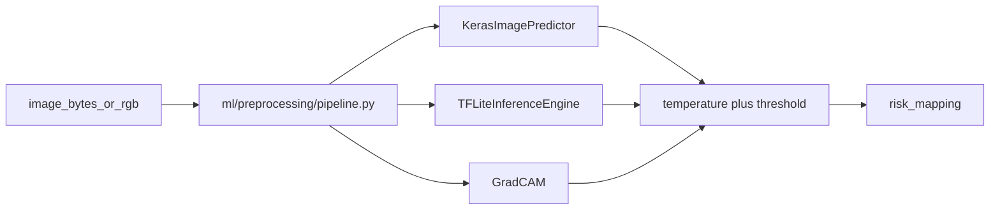

# Anemia Prediction API using CNN and Probability Calibration

## Abstract

Childhood anemia remains prevalent in low-resource settings, where timely laboratory access is often limited. This repository provides a backend system for **early risk screening** from **fingernail photographs** using a convolutional neural network (CNN) with transfer learning. Raw classifier scores are post-processed with **probability calibration** (temperature scaling) and a **data-driven operational threshold** derived from the receiver operating characteristic (ROC). The system outputs a **probability of elevated risk** for screening workflows; it does **not** constitute a clinical diagnosis.

## Method Overview

The imaging pipeline targets **nail-bed regions** as a non-invasive proxy signal. The CNN uses **MobileNetV2** pretrained on ImageNet, with a lightweight binary head (global pooling, dropout, sigmoid). **Input** consists of registered fingernail crops; **output** is a scalar probability of positive-class risk.

**Training** follows a two-phase schedule: (1) optimization of the classification head with the backbone frozen; (2) **partial fine-tuning** of the deepest layers of MobileNetV2 while earlier layers remain frozen. The minority (positive) class is addressed via **oversampling** in the training subset of the internal train/validation split. The reported production configuration uses **no `class_weight`** in the final training objective, in line with the selected experiment.

**Post-processing at inference** applies **temperature scaling** to the sigmoid probability, using a scalar temperature estimated on the validation split. The **operational decision rule** compares the calibrated probability to a threshold chosen by **maximization of Youden’s J** on the held-out test set under the calibrated scores.

## Model Configuration (v1.0)

| Parameter | Value |
|-----------|--------|
| `model_version` | `v1.0` |
| Temperature (scaling) | `0.7510018331928743` |
| Operational threshold (calibrated probability) | `0.1680544387290045` |

## Evaluation (Test Set)

The following metrics refer to **test-set** evaluation with the **calibrated** probability and the **operational** (Youden) threshold.

| Metric | Value |
|--------|------:|
| AUC | 0.795 |
| Recall | 0.741 |
| Precision | 0.455 |
| Accuracy | 0.793 |
| Brier score | 0.118 |
| Expected calibration error (ECE) | 0.060 |

The operational point prioritizes **recall** relative to precision, which is appropriate for screening where false negatives carry high clinical cost. **Calibration** (low Brier score and moderate ECE) improves the interpretability of reported probabilities compared to raw sigmoid outputs, without changing the discriminative ordering underlying the ROC.

## Experimental pipelines (G8–G10)

The following components are **research-grade** and aligned with the modular layout (`ml/preprocessing`, `ml/inference`, `ml/explainability`). They reuse the same **temperature scaling** and **operational threshold** logic as `POST /predict` (`backend.inference.probability_calibration`).

### G9 — Shared preprocessing (`ml/preprocessing/pipeline.py`)

Single entry point for **backend Keras**, **TFLite offline**, and **Grad-CAM**:

1. Decode (TensorFlow `decode_image`, RGB, robust formats).
2. Validate geometry, channels, and minimum size.
3. Resize to **224×224** (bilinear), float32 in \([0,255]\).
4. Optional **lighting normalization** (`off` by default to preserve published calibration): `per_image_standardize` or `brightness_contrast_stabilize` (percentile stretch). Enabling these changes score distributions and **requires re-fitting** \(T\) and the operational threshold on held-out data.
5. Optional **ROI hook** (`PreprocessingConfig.roi_extractor`) for future nail-region cropping (pass-through today).
6. `mobilenet_v2.preprocess_input` (same convention as `ml/baseline/dataops.py` training pipelines).
7. Batch dimension `(1,224,224,3)`.

The FastAPI path `prepare_prediction_image` → `predict_from_rgb` avoids decoding PNG twice while keeping the nail heuristic on the **uint8 RGB** tensor.



### G8 — Offline TFLite inference

- **Module:** `ml/inference/tflite_inference.py` — lazy-loaded interpreter, metadata validation, `TFLiteInferenceResult.to_sync_payload()` for future backend ingestion (field names aligned with `PredictionResponse`; `inference_mode="tflite_offline"` is also allowed on the API schema for documentation/sync).
- **CLI:** `ml/scripts/run_tflite_inference.py` — batch images, deterministic sorted JSON, optional `--artifacts-dir` → `ml/artifacts/tflite_runs/<run_id>/{outputs.json,manifest.json}`.
- **Export:** `ml/scripts/export_tflite.py` escribe `.tflite` en **float32** sin optimizaciones del convertidor (`converter.optimizations = []`) para maximizar la **paridad numérica** con Keras; tras cambiar el script o la versión de TensorFlow, vuelva a exportar y commitear el `.tflite` si `make ml-test` exige tolerancias estrictas.

Example (from repository root, with `PYTHONPATH` pointing at the repo so `backend` resolves):

```bash
cd ml && PYTHONPATH=.. python scripts/run_tflite_inference.py \
  --image path/to/sample.png \
  --tflite-path artifacts/models/baseline_mobilenetv2_v1.tflite \
  --metadata-path artifacts/models/baseline_mobilenetv2_v1.metadata.json \
  --artifacts-dir artifacts/tflite_runs
```

### G10 — Grad-CAM interpretability

Research **visual explanation** of where the network attends; **not** a diagnostic or a substitute for calibrated risk from `POST /predict`.

- **Module:** `ml/explainability/gradcam.py` — last `Conv2D` / `DepthwiseConv2D` inside `mobilenet_backbone` by default, optional `--layer` override, `GradCAMError` on missing gradients.
- **CLI:** `ml/scripts/generate_gradcam.py` — writes `ml/artifacts/explainability/<run_id>/<stem>/{original.png,preprocessed.png,heatmap.png,overlay.png,saliency.png,metadata.json}` with non-diagnostic disclaimer and pipeline provenance.

```bash
cd ml && PYTHONPATH=.. python scripts/generate_gradcam.py \
  --image path/to/sample.png \
  --output-dir artifacts/explainability
```

### TensorFlow Lite (summary)

- **Backend (online inference):** loads **Keras** (`.keras`) for `POST /predict`; temperature scaling and the operational threshold are applied **outside** the neural network (same pure functions as in `ml/inference/tflite_inference.py`).
- **Mobile / offline:** bundle the `.tflite` plus metadata JSON; the graph exposes **raw sigmoid probability** only; apply the same post-processing order as the server using exported `temperature` and `operational_threshold` on **calibrated** scores. Offline `TFLiteInferenceResult.to_sync_payload()` is structured so field names align with `PredictionResponse` for synchronization-ready payloads.
- **Backend tests:** `make test` never imports TensorFlow (`DISABLE_TF=1`); optional `ALLOW_BACKEND_TF=1` in `tests/conftest.py` only if you intentionally need a real `.keras` load during API tests (not recommended in CI).

## API

**`POST /predict`**  
Multipart request with a **required image** (JPEG, PNG, or WebP) and optional **`birth_date`** (for age metadata). The response includes **`raw_probability`** (sigmoid output of the CNN), **`calibrated_probability`** (after temperature scaling), **`threshold_used`**, **`prediction`** (binary decision on the calibrated score), and **`risk`** (coarse risk stratum), together with persistence metadata when configured.

**`GET /model/evaluation`**  
Returns **offline evaluation metrics** and **calibration-related parameters** aligned with the deployed model version (`v1.0`), including AUC, precision/recall/accuracy at the operational threshold, Brier score, ECE, and flags summarizing training choices (e.g., oversampling, use of class weights, backbone fine-tuning).

Authentication, database, and object storage are provided via **Supabase** (see configuration in `.env.example`).

## Reproducibility

- **Random seed:** 42 for stratified splitting and training stochasticity where applicable.  
- **Train/validation:** stratified split on image labels within the training directory.  
- **Train/test:** patient-level separation at dataset construction so that all crops from a given subject appear in only one of train or test.  
- **Artifacts:** training and calibration runs are logged as **JSON** and **Markdown** under `ml/artifacts/runs/` for traceability.

## Automated testing

- **API / core:** `make test` runs `pytest` on `tests/` only (see root `pytest.ini`). It sets `DISABLE_TF=1` and clears `INFERENCE_MODEL_PATH` so TensorFlow/Keras are never initialized and `.env` cannot pull in a `.keras` during collection.
- **ML (TensorFlow + local `.keras` / `.tflite`):** `make ml-test` runs `pytest` on `ml/tests/` with `PYTHONPATH=.` from the repo root and `ml/.venv/bin/python`. Requires Python **3.11** (see `.python-version`) and the committed artifacts under `ml/artifacts/models/`. On **macOS arm64**, TensorFlow **2.20+** can abort on import (`mutex lock failed`); `ml/requirements.txt` pins **TensorFlow 2.19.1** for a stable wheel set with `mlflow` (which constrains `pyarrow<20`).
- **Docker fallback:** `make ml-test-docker` construye `Dockerfile.ml-test` (Debian Bookworm, Python 3.11, `libgomp1`) e instala el mismo `ml/requirements.txt` que el venv local. Ejecuta `pytest ml/tests/` en el contenedor; no sustituye `make ml-test`.

### Validación recomendada (orden)

1. `make test` — suite del API sin TensorFlow.
2. `make ml-install` — crea `ml/.venv` si falta y reinstala dependencias ML.
3. `make ml-tf-check` — `import tensorflow as tf; print(tf.__version__)` (debe imprimir `2.19.1` con el pin actual).
4. `make ml-test` — pytest ML en el host (Apple Silicon).
5. `make ml-test-docker` — misma suite en Linux vía Docker.

## Project Structure

```
backend/     # FastAPI application, inference, configuration, Supabase integration
ml/          # Dataset utilities, training, calibration, G8–G10 modules, artifact outputs
ml/tests/    # TensorFlow-heavy tests (``make ml-test``)
tests/       # API and core unit tests (``make test``)
```

## Limitations

The model estimates **risk from imaging features**, not a definitive **diagnosis**; clinical correlation and laboratory follow-up remain necessary. Performance depends on **image quality**, illumination, and adherence to the intended capture protocol. **Dataset size and spectrum bias** may limit generalization to populations or devices not represented in development data.

## License

This software is intended for **academic and research use**. Redistribution, modification, and deployment for clinical or commercial purposes require appropriate ethical review, regulatory compliance, and explicit licensing terms beyond this document.
