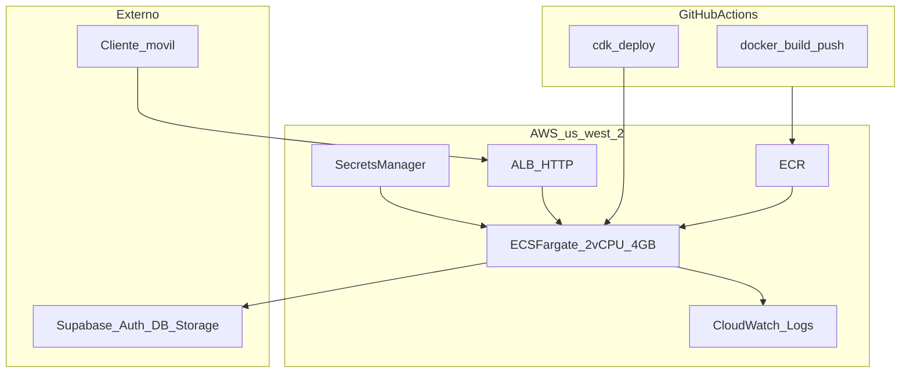

# Despliegue AWS (ECS Fargate + CDK Python)

Producción del API en **us-west-2** (Oregon, alineado con Supabase): contenedor Docker (FastAPI + TensorFlow + ensemble 3× `.keras`) detrás de un **Application Load Balancer**. **Supabase** sigue externo (Auth, Postgres, Storage).

## Arquitectura



**Flujo `POST /predict`:** ALB → FastAPI → inferencia ensemble → Supabase Storage + PostgREST.

| Componente | Rol |
|------------|-----|
| **ECR** | Imagen Docker del backend |
| **ECS Fargate** | 2 vCPU, 4 GB RAM, `desiredCount: 1` (always-on) |
| **ALB** | HTTP :80, health check `GET /health` |
| **Secrets Manager** | `anemia-api/prod` — Supabase + `METRICS_BEARER_TOKEN` |
| **CloudWatch** | Logs del contenedor |

**Red MVP:** VPC default, subnets públicas, `assignPublicIp: true`, **sin NAT Gateway** (~$32/mes ahorrados).

## Costos estimados (24/7, us-west-2)

| Recurso | ~USD/mes |
|---------|----------|
| Fargate 2 vCPU / 4 GB | ~72 |
| ALB | ~18–25 |
| ECR + CloudWatch | ~3–10 |
| **Total MVP** | **~95–110** |

Sin dominio custom ni NAT. HTTPS con dominio propio (Route53 + ACM) es opcional en una fase posterior.

---

## Prerrequisitos

1. Cuenta AWS con permisos para ECS, ECR, ALB, IAM, Secrets Manager, CloudWatch.
2. [AWS CLI v2](https://docs.aws.amazon.com/cli/latest/userguide/getting-started-install.html) configurado (`aws configure` o SSO).
3. Docker instalado (build de imagen).
4. Python 3.11+ para CDK (`infra/`).
5. Supabase: migraciones al día (`make db-push`).

---

## Paso a paso — primer despliegue

### 1. Bootstrap CDK (una vez por cuenta/región)

```bash
cd infra
python3 -m venv .venv && source .venv/bin/activate
pip install -r requirements.txt
export AWS_REGION=us-west-2
cdk bootstrap aws://$(aws sts get-caller-identity --query Account --output text)/us-west-2
```

### 2. Desplegar infraestructura (ECR, ECS, ALB, secret placeholder)

```bash
cdk deploy
```

Anotar outputs: `LoadBalancerDNS`, `EcrRepositoryUri`, `SecretArn`.

### 3. Rellenar secretos en Secrets Manager

Consola AWS → Secrets Manager → `anemia-api/prod` → **Store a new secret value** (JSON):

```json
{
  "SUPABASE_URL": "https://YOUR_PROJECT.supabase.co",
  "SUPABASE_KEY": "YOUR_ANON_KEY",
  "SUPABASE_SERVICE_ROLE_KEY": "YOUR_SERVICE_ROLE_KEY",
  "METRICS_BEARER_TOKEN": "GENERATE_STRONG_RANDOM_TOKEN"
}
```

Referencia de variables no secretas: [`aws.env.example`](../aws.env.example).

### 4. Build y push de la imagen Docker

```bash
# Desde la raíz del repo
ECR_URI=$(aws cloudformation describe-stacks --stack-name AnemiaApiStack \
  --query "Stacks[0].Outputs[?OutputKey=='EcrRepositoryUri'].OutputValue" --output text)
aws ecr get-login-password --region us-west-2 | docker login --username AWS --password-stdin "${ECR_URI%%/*}"
docker build -f Dockerfile -t "$ECR_URI:latest" .
docker push "$ECR_URI:latest"
```

### 5. Forzar nuevo despliegue ECS

```bash
aws ecs update-service \
  --cluster anemia-api-cluster \
  --service anemia-api-service \
  --force-new-deployment \
  --region us-west-2
```

(O repetir `cdk deploy -c imageTag=latest` tras el push.)

### 6. Smoke test

```bash
export SMOKE_BASE_URL=http://<LoadBalancerDNS>
export SMOKE_EMAIL=smoke@example.com
export SMOKE_PASSWORD=minimum8chars
export METRICS_BEARER_TOKEN=<mismo que Secrets Manager>
make smoke-prod
```

### 7. Verificar métricas

```bash
curl -sS -H "Authorization: Bearer $METRICS_BEARER_TOKEN" \
  "http://<LoadBalancerDNS>/metrics" | grep predict_phase_duration
```

Esperado: `inference` domina el tiempo en `predict_phase_duration_seconds`.

---

## CI/CD (GitHub Actions)

Workflow [`.github/workflows/deploy-aws.yml`](../.github/workflows/deploy-aws.yml) — disparo manual (`workflow_dispatch`):

**Secrets:** `AWS_ACCESS_KEY_ID`, `AWS_SECRET_ACCESS_KEY` (o OIDC con `AWS_ROLE_ARN`).

**Variables:** `AWS_REGION=us-west-2`, `SMOKE_BASE_URL` (URL del ALB).

Smoke post-deploy en el mismo workflow si están configurados `SMOKE_*`.

---

## Escalado y tuning

| Síntoma | Acción |
|---------|--------|
| OOM / 503 en `/predict` | Subir task a 4 GB → 8 GB en `infra/stacks/api_stack.py` |
| Inferencia lenta | Subir a 4 vCPU; revisar `/metrics` |
| Mucha concurrencia | `desired_count` > 1 (rate limit in-memory: una instancia hoy) |

Tras cambiar CPU/RAM: `cdk deploy`.

---

## Rollback

```bash
# Imagen anterior en ECR
docker pull $ECR_URI:previous-tag
docker tag $ECR_URI:previous-tag $ECR_URI:latest
docker push $ECR_URI:latest
aws ecs update-service --cluster anemia-api-cluster --service anemia-api-service --force-new-deployment
```

---

## HTTPS y dominio custom (fase 2)

1. Dominio en Route53.
2. Certificado ACM en us-west-2.
3. Listener HTTPS en ALB + redirect HTTP→HTTPS.
4. `TRUST_PROXY_HEADERS=true` ya está en el task.

---

## Troubleshooting

| Síntoma | Causa probable |
|---------|----------------|
| Target unhealthy | Task no arranca (secretos vacíos, imagen ausente en ECR) |
| 502 desde ALB | Contenedor caído; revisar CloudWatch `/ecs/anemia-api` |
| 401/403 API | JWT o Supabase incorrecto en Secrets Manager |
| Cold start largo | Normal en primer deploy; warm-up corre en lifespan |

Más operación local: [`RUNBOOK.md`](RUNBOOK.md). Smoke: [`RELEASE_1_SMOKE.md`](RELEASE_1_SMOKE.md).
