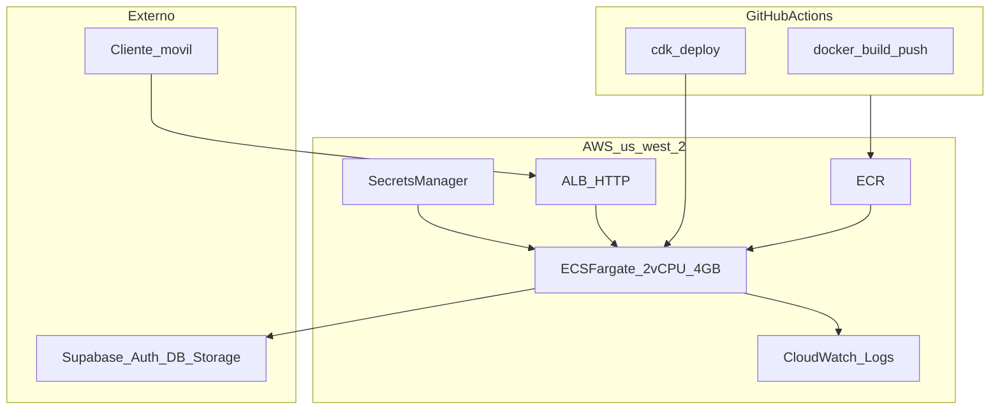

# Despliegue AWS (ECS Fargate + CDK Python) — histórico

**El stack ECS vivo se destruyó.** La producción actual es Fly.io: [`docs/DEPLOYMENT_FLY.md`](DEPLOYMENT_FLY.md). Este documento y `infra/` se conservan como IaC de referencia.

Producción *previa* del API en **us-west-2** (Oregon, alineado con Supabase): contenedor Docker (FastAPI + TensorFlow + ensemble 3× `.keras`) detrás de un **Application Load Balancer**. **Supabase** sigue externo (Auth, Postgres, Storage).

## Arquitectura



**Flujo `POST /predict`:** ALB → FastAPI → inferencia ensemble → Supabase Storage + PostgREST.

| Componente | Rol |
|------------|-----|
| **ECR** | Imagen Docker del backend |
| **ECS Fargate** | 2 vCPU, 4 GB RAM, `desiredCount: 1` (always-on) |
| **ALB** | HTTP :80, health check `GET /health` |
| **Secrets Manager** | `anemia-api/prod` — Supabase + `METRICS_BEARER_TOKEN` |
| **CloudWatch** | Logs del contenedor |

**Red MVP:** VPC default, subnets públicas, `assignPublicIp: true`, **sin NAT Gateway** (~$32/mes ahorrados).

## Costos estimados (24/7, us-west-2)

| Recurso | ~USD/mes |
|---------|----------|
| Fargate 2 vCPU / 4 GB | ~72 |
| ALB | ~18–25 |
| ECR + CloudWatch | ~3–10 |
| **Total MVP** | **~95–110** |

Sin dominio custom ni NAT. HTTPS con dominio propio (Route53 + ACM) es opcional en una fase posterior.

---

## Prerrequisitos

1. Cuenta AWS con permisos para ECS, ECR, ALB, IAM, Secrets Manager, CloudWatch.
2. [AWS CLI v2](https://docs.aws.amazon.com/cli/latest/userguide/getting-started-install.html) configurado (`aws configure` o SSO).
3. Docker instalado (build de imagen).
4. **Node.js 22** para CDK CLI (`.nvmrc` en la raíz → `nvm use`; `npm install -g aws-cdk@2`).
5. Python 3.11+ para CDK (`infra/`).
6. Supabase: migraciones al día (`make db-push`).

---

## Paso a paso — primer despliegue

### 1. Bootstrap CDK (una vez por cuenta/región)

```bash
# Desde la raíz del repo
nvm use
npm install -g aws-cdk@2

cd infra
python3 -m venv .venv && source .venv/bin/activate
pip install -r requirements.txt
export AWS_REGION=us-west-2
cdk bootstrap aws://$(aws sts get-caller-identity --query Account --output text)/us-west-2
```

### 2. Desplegar infraestructura (ECR, ECS, ALB, secret placeholder)

```bash
cdk deploy
```

Anotar outputs: `LoadBalancerDNS`, `EcrRepositoryUri`, `SecretArn`.

### 3. Rellenar secretos en Secrets Manager

Consola AWS → Secrets Manager → `anemia-api/prod` → **Store a new secret value** (JSON):

```json
{
  "SUPABASE_URL": "https://YOUR_PROJECT.supabase.co",
  "SUPABASE_KEY": "YOUR_ANON_KEY",
  "SUPABASE_SERVICE_ROLE_KEY": "YOUR_SERVICE_ROLE_KEY",
  "METRICS_BEARER_TOKEN": "GENERATE_STRONG_RANDOM_TOKEN"
}
```

Referencia de variables no secretas: [`aws.env.example`](../aws.env.example).

Tras guardar, **obligatorio** forzar nuevo despliegue ECS (las tareas en curso no recargan secretos solas):

```bash
aws ecs update-service \
  --cluster anemia-api-cluster \
  --service anemia-api-service \
  --force-new-deployment \
  --region us-west-2
```

Desde CLI (sustituye valores reales; no uses comillas en la shell si copias desde `.env`):

```bash
aws secretsmanager put-secret-value \
  --secret-id anemia-api/prod \
  --region us-west-2 \
  --secret-string "$(jq -n \
    --arg url "$SUPABASE_URL" \
    --arg key "$SUPABASE_KEY" \
    --arg svc "$SUPABASE_SERVICE_ROLE_KEY" \
    --arg metrics "$METRICS_BEARER_TOKEN" \
    '{SUPABASE_URL:$url,SUPABASE_KEY:$key,SUPABASE_SERVICE_ROLE_KEY:$svc,METRICS_BEARER_TOKEN:$metrics}')"
```

Si el smoke falla en `auth/login` HTTP 500, revisa CloudWatch `/ecs/anemia-api`: suele ser `SupabaseException: Invalid URL` → secretos aún en `REPLACE_ME`.

### 4. Build y push de la imagen Docker

**Fargate usa `linux/amd64`.** En Mac (Apple Silicon) hay que pasar `--platform linux/amd64` o usar `make docker-push-ecr` (login + build amd64 + push). El `Dockerfile` instala TensorFlow en una capa aparte con timeout largo de pip (~645 MB).

**Recomendado en Mac:** red estable (Ethernet), 30–60 min el primer build amd64.

El workflow de GitHub Actions para ECS se eliminó: producción vive en Fly.io ([`DEPLOYMENT_FLY.md`](DEPLOYMENT_FLY.md)). Para un rebuild local a ECR usa `make docker-push-ecr` (imagen `linux/amd64`).

```bash
# Opción A — Makefile (desde la raíz)
make docker-push-ecr

# Opción B — manual
ECR_URI=$(aws cloudformation describe-stacks --stack-name AnemiaApiStack \
  --region us-west-2 \
  --query "Stacks[0].Outputs[?OutputKey=='EcrRepositoryUri'].OutputValue" --output text)
aws ecr get-login-password --region us-west-2 | docker login --username AWS --password-stdin "${ECR_URI%%/*}"
docker build --platform linux/amd64 -f Dockerfile -t "$ECR_URI:latest" .
docker push "$ECR_URI:latest"
```

### 5. Forzar nuevo despliegue ECS

```bash
aws ecs update-service \
  --cluster anemia-api-cluster \
  --service anemia-api-service \
  --force-new-deployment \
  --region us-west-2
```

(O repetir `cdk deploy -c imageTag=latest` tras el push.)

### 6. Smoke test

```bash
export SMOKE_BASE_URL=http://<LoadBalancerDNS>
export SMOKE_EMAIL=smoke@example.com
export SMOKE_PASSWORD=minimum8chars
export METRICS_BEARER_TOKEN=<mismo que Secrets Manager>
make smoke-prod
```

### 7. Verificar métricas

```bash
curl -sS -H "Authorization: Bearer $METRICS_BEARER_TOKEN" \
  "http://<LoadBalancerDNS>/metrics" | grep predict_phase_duration
```

Esperado: `inference` domina el tiempo en `predict_phase_duration_seconds`.

---

## CI/CD (histórico)

El workflow **Deploy AWS** se eliminó para que un push a `main` no intente recrear ECS. El deploy vivo es [`.github/workflows/deploy-fly.yml`](../.github/workflows/deploy-fly.yml). CI de calidad: [`ci.yml`](../.github/workflows/ci.yml).

Este documento y `infra/` quedan como referencia para un rebuild **manual** (`cdk deploy`, `make docker-push-ecr`).

Obtén el DNS del ALB (si el stack existiera):

```bash
aws cloudformation describe-stacks --stack-name AnemiaApiStack --region us-west-2 \
  --query 'Stacks[0].Outputs[?OutputKey==`LoadBalancerDNS`].OutputValue' --output text
```

---

## Escalado y tuning

| Síntoma | Acción |
|---------|--------|
| OOM / 503 en `/predict` | Subir task a 4 GB → 8 GB en `infra/stacks/api_stack.py` |
| Inferencia lenta | Subir a 4 vCPU; revisar `/metrics` |
| Mucha concurrencia | Subir CPU/RAM del task; mantener `desiredCount: 1` (rate limit in-memory no es global entre tareas) |
| p95 alto en fase `inference` | Mantener `INFERENCE_TTA_ENABLED=false` (default); subir vCPU del task |

### Baseline de latencia

Antes de tuning, registrar p50/p95 de `predict_phase_duration_seconds` (ver [`RUNBOOK.md`](RUNBOOK.md#baseline-de-latencia-antes-de-cambios-de-caché) y [`OBSERVABILITY.md`](OBSERVABILITY.md)).

Tras cambiar CPU/RAM: `cdk deploy`.

---

## Rollback

```bash
# Imagen anterior en ECR
docker pull $ECR_URI:previous-tag
docker tag $ECR_URI:previous-tag $ECR_URI:latest
docker push $ECR_URI:latest
aws ecs update-service --cluster anemia-api-cluster --service anemia-api-service --force-new-deployment
```

---

## HTTPS y dominio custom (fase 2)

1. Dominio en Route53.
2. Certificado ACM en us-west-2.
3. Listener HTTPS en ALB + redirect HTTP→HTTPS.
4. `TRUST_PROXY_HEADERS=true` ya está en el task.

---

## Troubleshooting

| Síntoma | Causa probable |
|---------|----------------|
| Circuit breaker / `CannotPullContainerError` `latest: not found` | ECS escaló a 1 antes de que existiera `:latest` en ECR. Bootstrap: `cdk deploy -c desiredCount=0` → build/push → `aws ecs update-service --desired-count 1` |
| `ROLLBACK_COMPLETE` tras deploy | No lances dos `cdk deploy` en paralelo. Borra o continúa el stack fallido en CloudFormation y vuelve a desplegar |
| `CannotPullContainerError` / `linux/amd64` | Imagen en ECR solo arm64; rebuild con `--platform linux/amd64` o `make docker-push-ecr` |
| `ECR Repository already exists` (Early validation) | Stack borrado pero ECR quedó por `RemovalPolicy.RETAIN`; borra el repo en consola ECR |
| `docker build` falla en `tensorflow` (Read timed out) | Wheel ~645 MB; reintentar con red estable; capa TF en Dockerfile usa `PIP_DEFAULT_TIMEOUT=1000` |
| Target unhealthy | Task no arranca (secretos vacíos, imagen ausente en ECR) |
| 502 desde ALB | Contenedor caído; revisar CloudWatch `/ecs/anemia-api` |
| 401/403 API | JWT o Supabase incorrecto en Secrets Manager |
| `auth/login` HTTP 500 tras deploy | `SUPABASE_URL` en `REPLACE_ME` o inválida → CloudWatch: `SupabaseException: Invalid URL`. Edita `anemia-api/prod` y `force-new-deployment` |
| Cold start largo | Normal en primer deploy; warm-up corre en lifespan |

Más operación local: [`RUNBOOK.md`](RUNBOOK.md). Release y smoke: [`RELEASE.md`](RELEASE.md).
