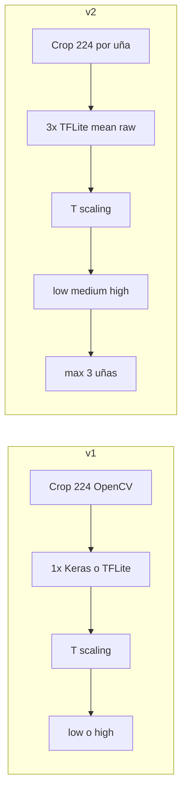

# Comparativa v1 vs v2 (modelo pediátrico Ghana)

Documento de referencia para tesis y producto (proxy Perú). Dataset de evaluación habitual: **`data/ghana/test` augmented** (~865 crops), salvo la sección [Evaluación original-only](#evaluación-original-only).

## Resumen ejecutivo

**v1** es un único checkpoint MobileNetV2 entrenado en Ghana con augmentación (semilla 42), con riesgo **binario** (`low` / `high`) y calibración post-hoc. En test Ghana alcanza **AUC ≈ 0,69**, el mejor discriminador del pipeline pediátrico hasta la fase ensemble.

**v2** mantiene el mismo proxy de dominio pero despliega **tres semillas** (42, 123, 456) con promedio de probabilidad raw, calibración conjunta, riesgo en **tres niveles** (bajo / medio / alto) y contrato móvil (3× TFLite). En el mismo test augmented, **AUC ≈ 0,68** — ligeramente por debajo de v1, dentro del margen esperado del ensemble (~0,01–0,03).

**Conclusión honesta:** el salto grande del proyecto fue **Ghana scratch → Ghana augmented** (AUC ~0,47 → ~0,69). **v1 → v2 no mejora AUC**; mejora **robustez de despliegue, UX de cribado y alineación API/móvil**. Para producción y tesis de sistema se recomienda **v2**; para citar el mejor número ROC puntual en slides ML puede usarse **v1** indicando que el ensemble es equivalente.

## Dos saltos distintos

| Salto | Qué cambió | AUC test Ghana (augmented) |
|-------|------------|----------------------------|
| Scratch → augmented | Datos de entrenamiento (~3960 crops) | **~0,47 → ~0,69** |
| v1 (1 seed) → v2 (ensemble) | 3 modelos + tiers + TFLite×3 | **~0,690 → ~0,682** |

## Tabla comparativa (test augmented)

Fuentes: [experiment_20260601T051158Z](../ml/artifacts/runs/experiment_20260601T051158Z.json) (v1 train), [calibration_20260601T052254Z](../ml/artifacts/runs/calibration_20260601T052254Z.json) (v1 cal.), [calibration_ensemble_ghana_v2](../ml/artifacts/runs/calibration_ensemble_ghana_v2.json) (v2).

| Dimensión | v1 | v2 |
|-----------|----|----|
| **Artefacto principal** | `baseline_mobilenetv2_ghana_augmented.keras` | `baseline_mobilenetv2_ghana_augmented_seed{42,123,456}.keras` |
| **Inferencia API** | 1× `.keras` (`INFERENCE_MODEL_PATH`) | 3× `.keras`, media de `raw_prob` (`INFERENCE_MODEL_PATHS`) |
| **AUC test (calibrado)** | **0,691** | **0,682** |
| **Temperatura T** | 4,953 | 1,405 |
| **τ alto (high_lower / operacional)** | 0,462 | 0,382 |
| **τ bajo (low_upper)** | — (solo binario) | 0,324 |
| **Precision @ τ operacional** | 0,648 | 0,635 |
| **Recall @ τ operacional** | 0,593 | 0,716 |
| **Salida de riesgo** | `low` \| `high` | `low` \| `medium` \| `high` |
| **Móvil offline** | 1× TFLite + metadata | 3× TFLite + `baseline_mobilenetv2_ghana_ensemble.metadata.json` |
| **`MODEL_VERSION`** | v1.0 | v2.0 |
| **Run de referencia** | `experiment_20260601T051158Z`, `calibration_20260601T052254Z` | `calibration_ensemble_ghana_v2` |

### Nota sobre recall y precisión

Las métricas @τ usan **Youden en validación** aplicado a test, con **T y τ distintos** entre v1 y v2. No son comparables como “v2 detecta más” sin recalibrar v1 con el mismo protocolo. El AUC sí es comparable (invariante a escalado monótono del score).

El informe de entrenamiento v1 ([051158Z](../ml/artifacts/runs/experiment_20260601T051158Z.json)) reporta recall **0,764** con τ optimizado en ese mismo paso de evaluación (score sin calibrar en test); la fila de arriba usa el flujo **de producción** (calibrado + τ de val).

## Flujo de inferencia



Detalle móvil (anular, medio, índice; agregación por mano): [MOBILE_INFERENCE.md](../ml/docs/MOBILE_INFERENCE.md).

## Ablaciones v2 (no superan v1 en AUC)

| Experimento | AUC test augmented | Desplegar |
|-------------|-------------------|-----------|
| Focal loss (γ=2) | 0,675 | No (solo tesis) |
| Augment online tipo móvil | 0,668 | No (solo tesis) |

Runs: [experiment_20260601T064911Z](../ml/artifacts/runs/experiment_20260601T064911Z.json), [experiment_20260601T065733Z](../ml/artifacts/runs/experiment_20260601T065733Z.json).

## Evaluación original-only

Métrica más honesta por **sujeto** (un PNG por niño en test, sin duplicados por augment). Ver filas en [CONFERENCE_EXPERIMENTS.md](../ml/docs/CONFERENCE_EXPERIMENTS.md#evaluación-original-only).

Comando:

```sh
# v1
docker run --rm -v "$(pwd):/workspace" -w /workspace/ml -e PYTHONPATH=/workspace anemia-ml-test \
  python scripts/evaluate_ghana_original_only.py \
  --model-path artifacts/models/baseline_mobilenetv2_ghana_augmented.keras \
  --calibration-json artifacts/runs/calibration_20260601T052254Z.json

# v2 ensemble (ver script; requiere --ensemble y varias --model-path)
```

## Qué citar en la tesis

| Tema | Versión recomendada |
|------|---------------------|
| Mejor AUC en tabla ML (proxy Ghana) | **v1** (~0,69) o “ensemble ~0,68, equivalente” |
| Sistema desplegado, API, app, tiers | **v2** |
| Limitación población | Ninguna validada en Perú; proxy Ghana ≤5 años |
| Tier “medio” | Zona gris; no es diagnóstico |

**No afirmar:** que v2 supera v1 en AUC, ni validación clínica en cohorte peruana.

## Pendientes (post v2)

| Ítem | Estado |
|------|--------|
| Ensemble + calibración + TFLite + API tiers | Hecho |
| `.env` con `INFERENCE_MODEL_PATHS` y umbrales v2 | Hecho |
| Evaluación original-only documentada | Ver tabla en CONFERENCE_EXPERIMENTS |
| TTA API (`INFERENCE_TTA_ENABLED`) | Implementado; validar en prod si se activa |
| Piloto cualitativo Perú (sin Hb) | Futuro |
| Integración React Native + OpenCV | Compañero; contrato en MOBILE_INFERENCE |

## Enlaces

- [CONFERENCE_EXPERIMENTS.md](../ml/docs/CONFERENCE_EXPERIMENTS.md) — índice de runs
- [MOBILE_INFERENCE.md](../ml/docs/MOBILE_INFERENCE.md) — contrato offline
- [ml/README.md](../ml/README.md) — comandos Makefile
